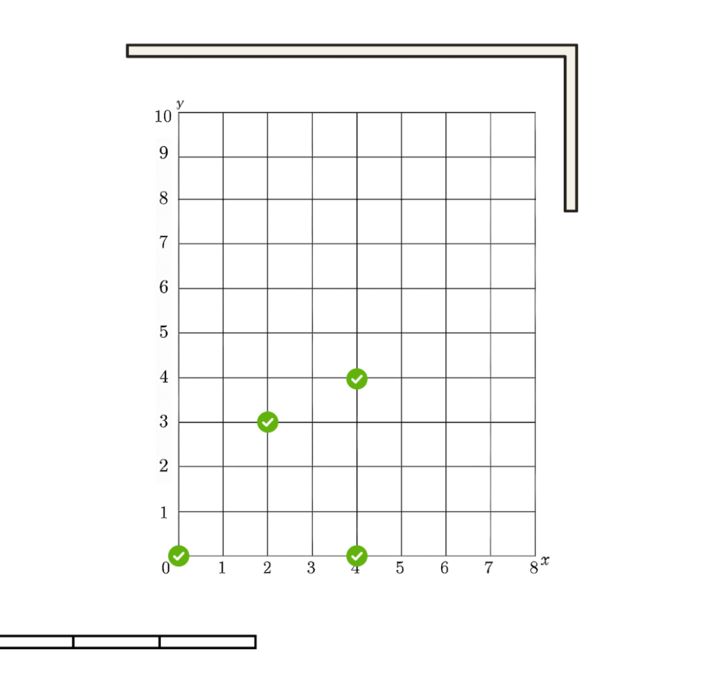
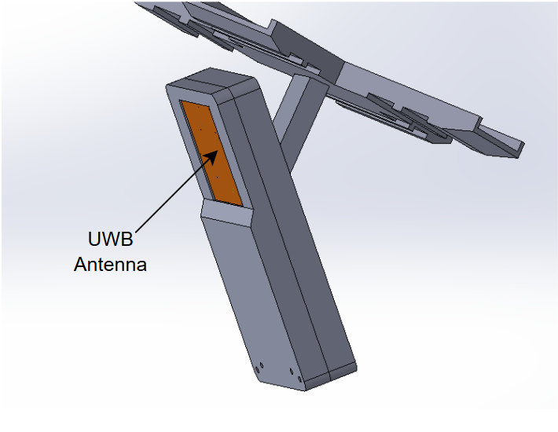
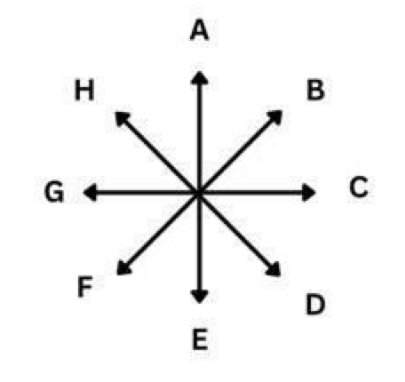
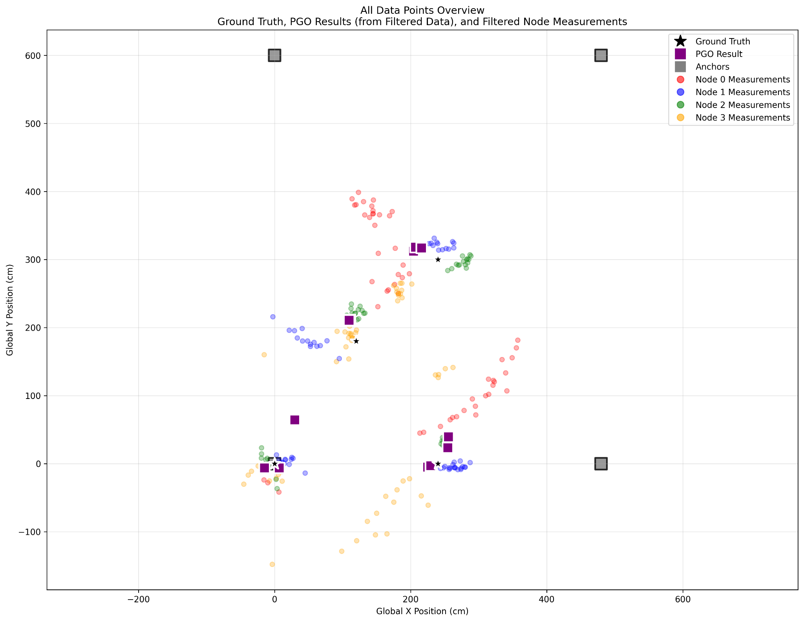

- [Home](index.md)
- [Impact](impact.md)
- [System Architecture](system_architecture.md)
- [PGO, Algorithms, and Optimization](pgo_algorithms_and_optimization.md)
- [Application Layer (Demos)](application_layer_demos.md)
- [Data Collection and Validation](data_collection_and_validation.md)
- [Software Engineering](software_engineering.md)
- [Location-Aware Applications](location_aware_applications.md)
- [Final Report](final_report.md)

## 5. Data Collection and Validation

To ensure the accuracy and reliability of our system, we followed a rigorous data collection and validation process. A fixed test rig was constructed to ensure repeatability and eliminate confounding variables.

### Test Rig and Setup

We constructed a fixed test rig in the i-Lounge at EA-04-04 to ensure repeatability and eliminate confounding variables. The setup consists of four UWB anchors mounted on the ceiling in a rectangular configuration. The anchors are mounted with a 45° downward pitch to optimize their coverage of the test area.

*Fig 6: Test rig system and coordinates for data collection*

*Fig 7: Fixed 45° UWB module ceiling mounts*

### Data Collection Process

We collected data at four fixed coordinates within the test rig. At each coordinate, we tested various orientations of the UWB transmitter (an iPhone) to account for the variations in signal strength and quality.

*Fig 8: Directions of the phone*

The main aspects we evaluated were:

*   How the data changes with the user's movement throughout the area.
*   How the data changes with the rotation of the UWB device.
*   How the data varies with the addition of each UWB anchor.
*   How the output from our middleware compares with the raw coordinates.

This comprehensive data collection process allowed us to validate the performance of our system and make iterative improvements to our algorithms.

### Raw Data

The following plot shows an example of the raw data collected from the UWB anchors. The different colors represent the measurements from each of the four anchors. As you can see, there is a noticeable spatial dispersion and noise in the raw data, which highlights the need for the filtering and optimization techniques used in our middleware.

*Fig 19. Raw Data collection*