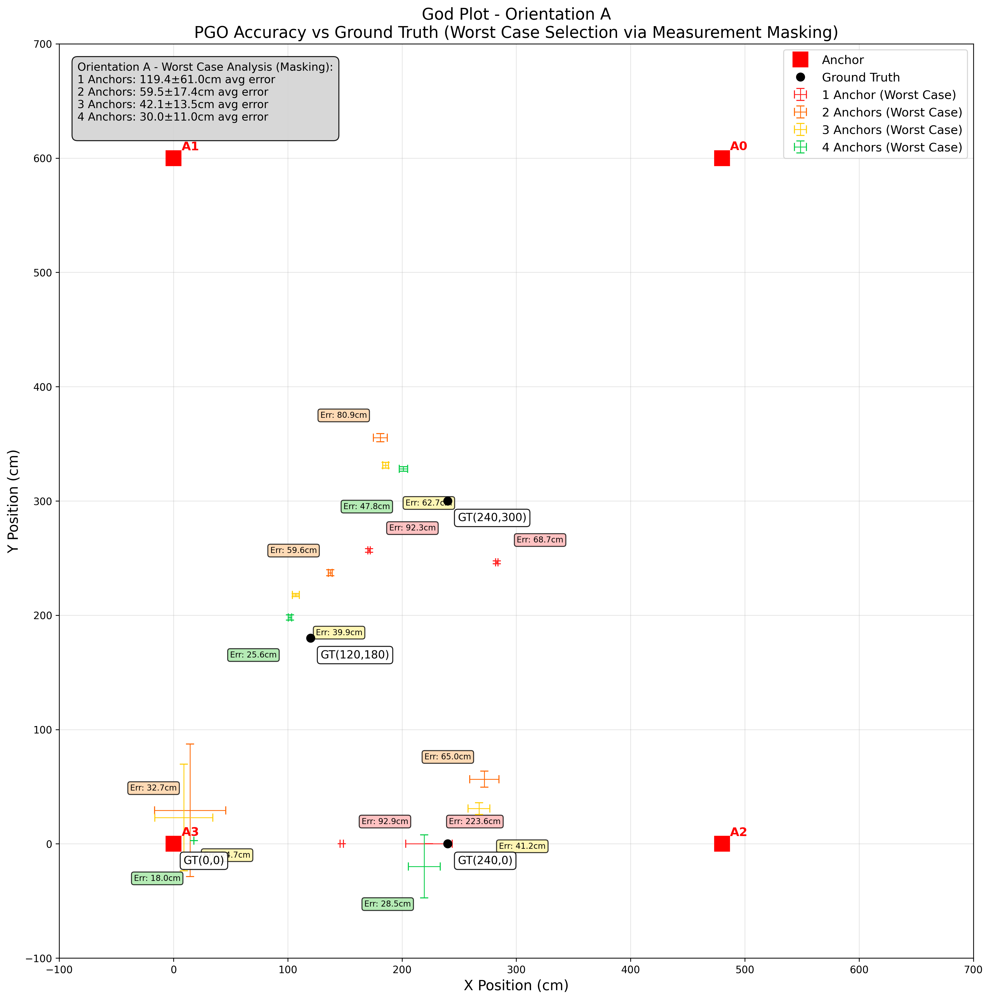

# UWB Localization Mesh Project

Welcome to the project page for the UWB Localization Mesh project.

## 1. Impact

This project introduces a UWB-based middleware that transforms raw radio-frequency data into a high-resolution spatial grid, enabling precise indoor localization. This technology empowers Bang & Olufsen (B&O) to create seamless, spatially adaptive audio experiences that respond intuitively to a listener's position.

**Key achievements:**

*   **~32% accuracy improvement:** Our middleware consistently improves position accuracy by approximately 32% compared to the worst-anchor baseline.
*   **3-4x error reduction:** The system significantly reduces the mean error by a factor of 3 to 4.
*   **Enhanced reliability:** By rejecting roughly 10% of noisy data, our solution provides a stable, high-fidelity location data feed suitable for responsive multi-room sound experiences.
*   **New user experiences:** This technology paves the way for innovative features such as "Follow-Me" audio sweet-spots, adaptive multi-room speaker switching, and localization-based playlist transitions.


## 2. System Architecture

Our system is designed with a three-layer architecture to ensure modularity, scalability, and real-time performance.


### The Three Layers:

1.  **Edge Layer:** This layer consists of multiple NXP Type-2BP UWB modules that act as anchors. These anchors collect Time-of-Flight (ToF) and Angle-of-Arrival (AoA) data from a UWB-enabled device, such as an iPhone, which acts as the transmitter.

2.  **Communication Layer:** A distributed MQTT (Message Queuing Telemetry Transport) Pub-Sub framework forms the backbone of our communication layer. Each anchor publishes its data over Wi-Fi to a central broker. This lightweight and scalable solution ensures resilient communication across multiple rooms.

3.  **Processing Layer:** This is the core of our middleware. A Pose Graph Optimization (PGO) algorithm fuses the data from all anchors to produce a globally consistent position estimate. This layer also includes outlier rejection and a sliding-window filter to reduce noise and reject erroneous readings in real-time.


## 3. PGO, Algorithms, and Optimization

At the heart of our middleware is a Pose Graph Optimization (PGO) algorithm. This approach treats the localization problem as a graph, where the UWB anchors are nodes and the measurements between them are edges. By minimizing the error across the entire graph, we can fuse the data from multiple anchors to achieve a more accurate and reliable position estimate.

### Optimizing PGO Inputs

The performance of the PGO system is highly dependent on the quality of the input edges. To ensure the best possible inputs, we have implemented several optimization techniques:

*   **Sliding Window:** Instead of running PGO on every new data point (which can be noisy), we use a 2-second sliding window to average out noise and update the datapoints in larger steps.
*   **Outlier Rejection:** We've implemented checks to reject "very wrong" measurements that could skew the sliding window average. This filter rejects approximately 10.05% of the data, which are identified as statistical outliers.
*   **Dynamic Anchor Disabling:** If an anchor is performing poorly and its variance is too high, we can temporarily disable it from the PGO calculation to prevent it from corrupting the overall estimate.

### Performance Gains

The following "God Plot" illustrates the performance improvement achieved through our PGO algorithm and optimization techniques. It shows how the accuracy improves as we add more anchors to the system.



As you can see, the estimated position (in red) gets closer to the ground truth (the center of the crosshairs) as we increase the number of anchors from 1 to 4. This demonstrates the effectiveness of our sensor fusion approach.


## 4. Application Layer (Demos)

The high-precision localization data from our middleware unlocks a wide range of exciting application possibilities. We have developed several demos to showcase the potential of this technology.

<video src="./assets/Demo.mov" controls="controls" style="max-width: 720px;">
</video>

### Demo Scenarios:

*   **"Follow-Me" Audio Sweet-Spot:** Imagine the perfect audio experience that follows you as you move. Our system can dynamically adjust the audio output of stereo speakers to ensure you are always in the acoustic "sweet-spot."

*   **Adaptive Multi-Room Speaker Switching:** As you walk from one room to another, the music seamlessly crossfades between speakers, creating an uninterrupted listening experience without any manual intervention.

*   **Localization-based Playlist Transitions:** The system can learn your listening habits and automatically switch playlists based on your location. For example, it might play classical music when you're in the living room and switch to rock when you enter the kitchen.


## 5. Data Collection and Validation

To ensure the accuracy and reliability of our system, we followed a rigorous data collection and validation process.

### Test Rig and Setup

We constructed a fixed test rig in the i-Lounge at EA-04-04 to ensure repeatability and eliminate confounding variables. The setup consists of four UWB anchors mounted on the ceiling in a rectangular configuration. The anchors are mounted with a 45° downward pitch to optimize their coverage of the test area.

**Image of Test Rig (Fig 6 from report)**

**Image of UWB module ceiling mounts (Fig 7 from report)**

### Data Collection Process

We collected data at four fixed coordinates within the test rig. At each coordinate, we tested various orientations of the UWB transmitter (an iPhone) to account for the variations in signal strength and quality.

**Image of Phone Orientations (Fig 8 from report)**

The main aspects we evaluated were:

*   How the data changes with the user's movement throughout the area.
*   How the data changes with the rotation of the UWB device.
*   How the data varies with the addition of each UWB anchor.
*   How the output from our middleware compares with the raw coordinates.

This comprehensive data collection process allowed us to validate the performance of our system and make iterative improvements to our algorithms.


## 6. SWE Structure, Packages etc.

Our system is built on a robust and modular software architecture that is designed for scalability and ease of use.

### Publish-Subscribe Architecture

We use a publish-subscribe (pub-sub) architecture based on MQTT for communication between the UWB anchors and the central processing unit. This decoupled approach allows for a flexible and scalable system where anchors can be added or removed without affecting the overall system.

### Modular Design

The entire system is designed with a clear separation of concerns, which makes it easy to maintain and extend. The core functionalities are divided into three distinct layers:

*   **Hardware Layer:** Interacts with the UWB hardware.
*   **Communication Layer:** Handles data transfer using MQTT.
*   **Processing Layer:** Performs the PGO calculations and other optimizations.

### Python Packages

We have packaged the core functionalities of our system into easy-to-use Python packages. This allows developers to quickly integrate our localization middleware into their own applications with just a few lines of code.

Here's an example of how to bring up the system:

```python
# Configure MQTT with your laptop's IP
mqtt_config = MQTTConfig(
    broker="192.168.68.66",  # Replace with your laptop's IP
    port=1884
)

# Start server
server = ServerBringUp(
    mqtt_config=mqtt_config,
    window_size_seconds=1.0
)

try:
    server.start()
    print("Server started. Waiting for anchor connections...")
    while True:
        if server.user_position is not None:
            print(f"Current position: {server.user_position}")
        time.sleep(1)
except KeyboardInterrupt:
    server.stop()
```

This simple and intuitive API makes it easy for developers to focus on building their applications without having to worry about the complexities of the underlying localization technology.

