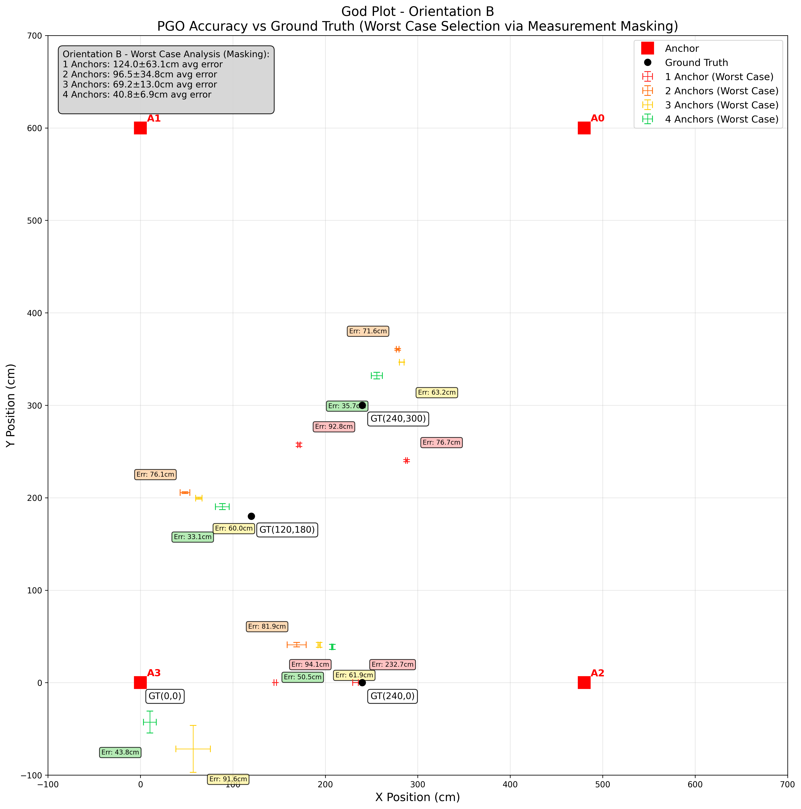
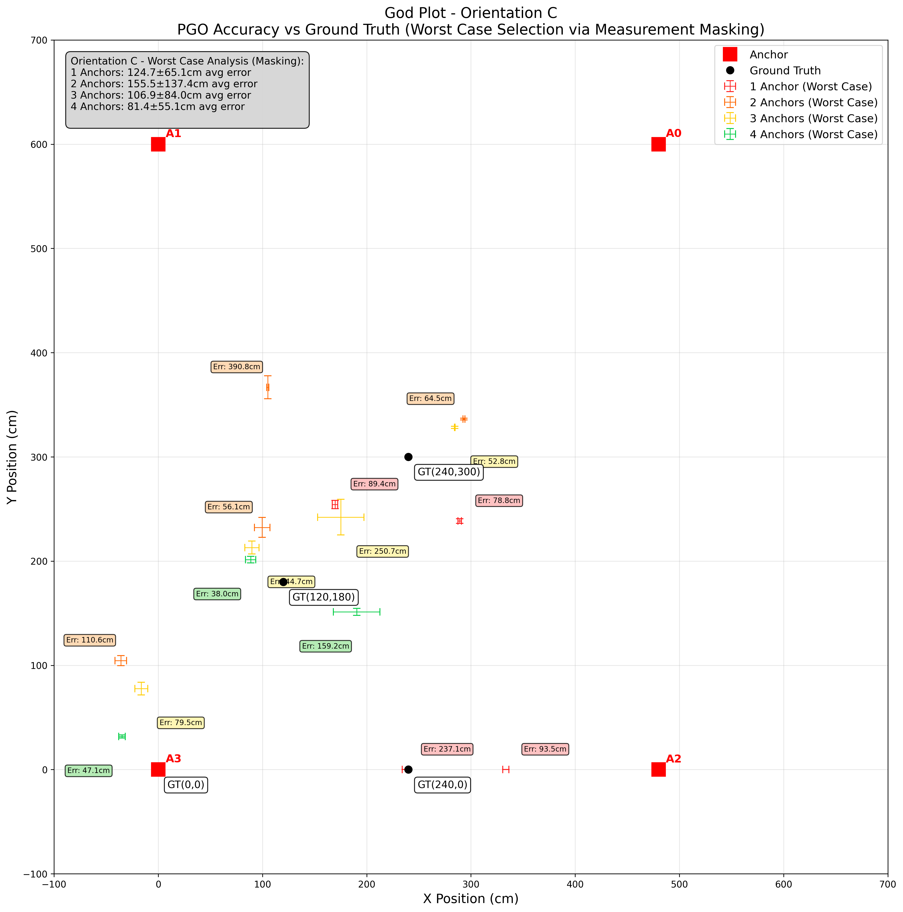
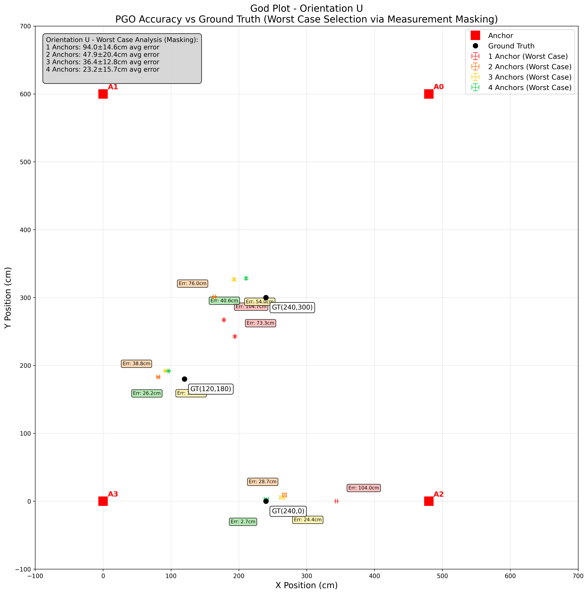

- [Home](index.md)
- [Impact](impact.md)
- [System Architecture](system_architecture.md)
- [PGO, Algorithms, and Optimization](pgo_algorithms_and_optimization.md)
- [Application Layer (Demos)](application_layer_demos.md)
- [Data Collection and Validation](data_collection_and_validation.md)
- [Software Engineering](software_engineering.md)
- [Location-Aware Applications](location_aware_applications.md)
- [Final Report](final_report.md)

## 3. PGO, Algorithms, and Optimization

At the heart of our middleware is a Pose Graph Optimization (PGO) algorithm. This approach treats the localization problem as a graph, where the UWB anchors are nodes and the measurements between them are edges. By minimizing the error across the entire graph, we can fuse the data from multiple anchors to achieve a more accurate and reliable position estimate.

The core idea behind PGO is to represent the relationships between different measurements as a graph. Each anchor and the transmitter are nodes in the graph, and the measurements between them are edges. Since each measurement is slightly inaccurate, the graph will have inconsistencies. PGO attempts to correct these inconsistencies by adjusting the nodes (the positions of the anchors and the transmitter) to minimize the overall error in the graph.

### Optimizing PGO Inputs

The performance of the PGO system is highly dependent on the quality of the input edges. To ensure the best possible inputs, we have implemented several optimization techniques:

*   **Sliding Window:** Instead of running PGO on every new data point (which can be noisy), we use a 2-second sliding window to average out noise and update the datapoints in larger steps. This approach helps to smooth out the measurements and reduce the impact of individual noisy readings.
*   **Outlier Rejection:** We've implemented checks to reject "very wrong" measurements that could skew the sliding window average. This filter rejects approximately 10.05% of the data, which are identified as statistical outliers. This is a crucial step to prevent the PGO algorithm from being influenced by erroneous data.
*   **Dynamic Anchor Disabling:** If an anchor is performing poorly and its variance is too high, we can temporarily disable it from the PGO calculation to prevent it from corrupting the overall estimate. This dynamic approach ensures that the system is resilient to individual anchor failures or periods of poor performance.

### Performance Gains

The following "God Plots" illustrate the performance improvement achieved through our PGO algorithm and optimization techniques across different phone orientations. Each plot shows how the accuracy improves as we add more anchors to the system, demonstrating the effectiveness of our sensor fusion approach.

#### Orientation A

*Fig 1: Performance improvement with increasing number of anchors (Orientation A)*

#### Orientation B

*Fig 2: Performance improvement with increasing number of anchors (Orientation B)*

#### Orientation C

*Fig 3: Performance improvement with increasing number of anchors (Orientation C)*

#### Orientation U (Phone camera facing upwards)

*Fig 4: Performance improvement with increasing number of anchors (Orientation U)*

In each plot, the estimated position (shown in red) converges closer to the ground truth (the center of the crosshairs) as we increase the number of anchors from 1 to 4. The "whiskers" on each plot represent the standard error, which decreases with more anchors, indicating improved stability and reliability.

These results demonstrate the robustness of our PGO algorithm across different device orientations, showing consistent performance improvements regardless of how the user holds their device. The multi-anchor fusion significantly reduces both the position error and the uncertainty in the estimates.