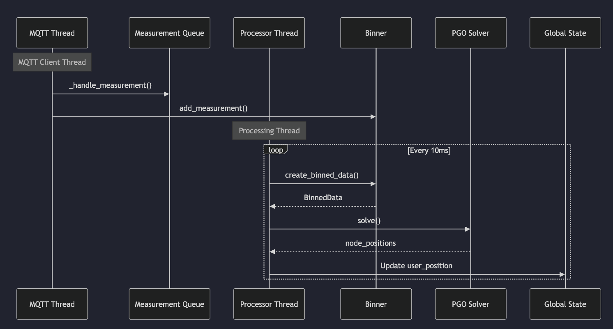

- [Home](index.md)
- [Impact](impact.md)
- [System Architecture](system_architecture.md)
- [PGO, Algorithms, and Optimization](pgo_algorithms_and_optimization.md)
- [Application Layer (Demos)](application_layer_demos.md)
- [Data Collection and Validation](data_collection_and_validation.md)
- [Software Engineering](software_engineering.md)
- [Location-Aware Applications](location_aware_applications.md)
- [Final Report](final_report.md)

## 6. SWE Structure, Packages etc.

Our system is built on a robust and modular software architecture that is designed for scalability and ease of use.

### Publish-Subscribe Architecture

We use a publish-subscribe (pub-sub) architecture based on MQTT for communication between the UWB anchors and the central processing unit. This decoupled approach allows for a flexible and scalable system where anchors can be added or removed without affecting the overall system. The use of MQTT also allows for a high degree of interoperability.

The following UML diagram illustrates the MQTT communication between the different processes:



### Modular Design

The entire system is designed in a way that it is easy to extend. The core functionalities are divided into three distinct layers:

*   **Hardware Layer:** Interacts with the UWB hardware. This layer is responsible for configuring the UWB modules and reading the raw sensor data.
*   **Communication Layer:** Handles data transfer using MQTT. This layer is responsible for publishing the sensor data from the anchors and subscribing to it on the central processing unit.
*   **Processing Layer:** Performs the PGO calculations and other optimizations. This layer is where the magic happens. It takes the raw sensor data from the communication layer and turns it into a high-precision location estimate.

### Python Packages

We have packaged the core functionalities of our system into easy-to-use Python packages. This allows developers to quickly integrate our localization middleware into their own applications with just a few lines of code. The packages are designed to be side-effect free and simple to use.

Here's an example of how to bring up the system:

```python
# Configure MQTT with your laptop's IP
mqtt_config = MQTTConfig(
    broker="192.168.68.66",  # Replace with your laptop's IP
    port=1884
)

# Start server
server = ServerBringUp(
    mqtt_config=mqtt_config,
    window_size_seconds=1.0
)

try:
    server.start()
    print("Server started. Waiting for anchor connections...")
    while True:
        if server.user_position is not None:
            print(f"Current position: {server.user_position}")
        time.sleep(1)
except KeyboardInterrupt:
    server.stop()
```

This simple and intuitive API makes it easy for developers to focus on building their applications without having to worry about the complexities of the underlying localization technology.