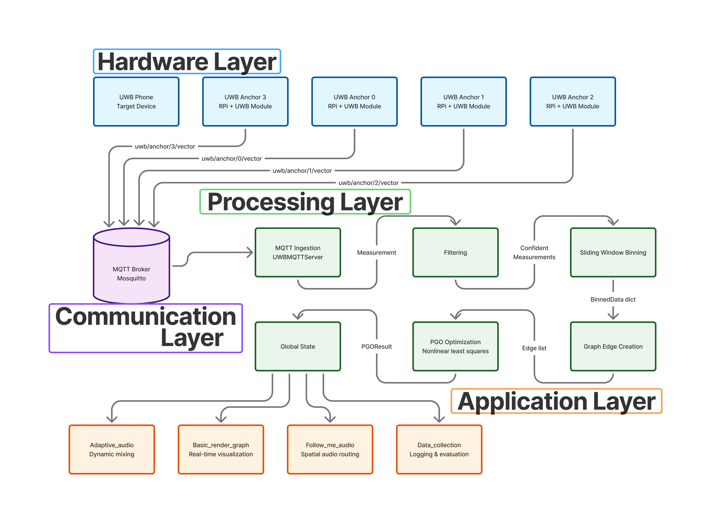
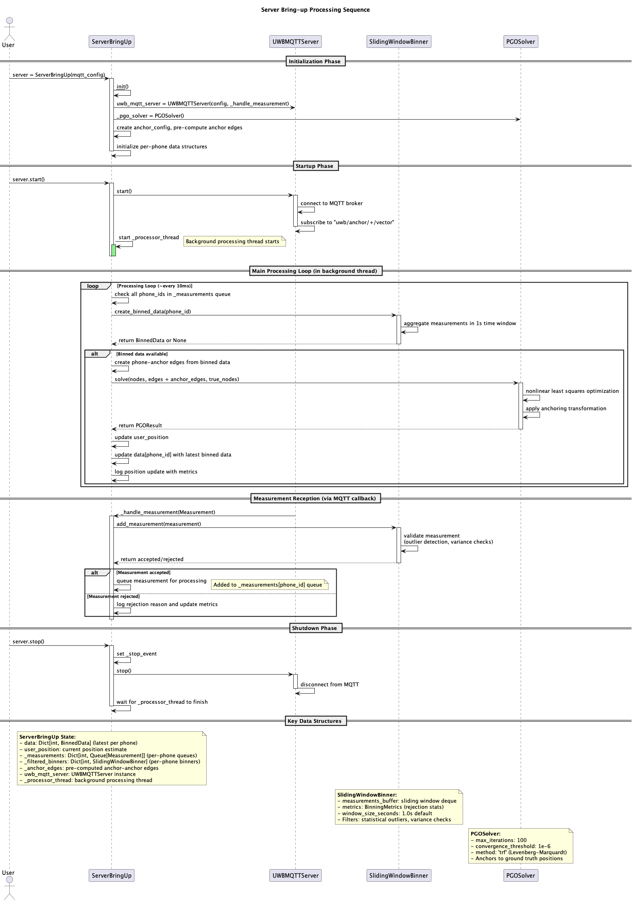

## 2. System Architecture

Our system is designed with a three-layer architecture to ensure modularity, scalability, and real-time performance. This modular approach allows for independent development and testing of each component, which is crucial for a complex system like this.

### The Three Layers:

1.  **Edge Layer:** This layer consists of multiple NXP Type-2BP UWB modules that act as anchors. These anchors are responsible for collecting Time-of-Flight (ToF) and Angle-of-Arrival (AoA) data from a UWB-enabled device, such as an iPhone, which acts as the transmitter. The anchors are connected to Raspberry Pi's, which process the raw data from the UWB modules and prepare it for transmission.

2.  **Communication Layer:** A distributed MQTT (Message Queuing Telemetry Transport) Pub-Sub framework forms the backbone of our communication layer. Each anchor publishes its data over Wi-Fi to a central broker. This lightweight and scalable solution ensures resilient communication across multiple rooms. The use of MQTT allows for a flexible system where anchors can be added or removed without affecting the overall system.

3.  **Processing Layer:** This is the core of our middleware. A Pose Graph Optimization (PGO) algorithm fuses the data from all anchors to produce a globally consistent position estimate. This layer also includes outlier rejection and a sliding-window filter to reduce noise and reject erroneous readings in real-time. The processing layer is responsible for transforming the local anchor-based measurements into a global coordinate system.

### Server Bring-up Sequence

The following sequence diagram illustrates the process of bringing up the server and the interaction between the different components.

### System UML Diagram

This UML diagram provides a more detailed view of the classes and their relationships within the system.

  {{ "/assets/system_uml_diagram.puml" | relative_url | read_file }}

