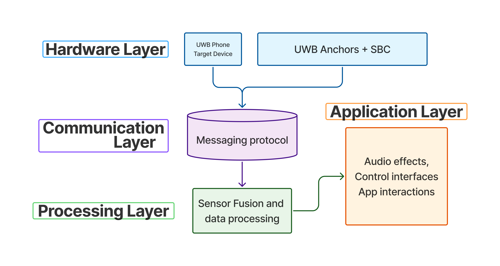

- [Home](index.md)
- [Impact](impact.md)
- [System Architecture](system_architecture.md)
- [PGO, Algorithms, and Optimization](pgo_algorithms_and_optimization.md)
- [Application Layer (Demos)](application_layer_demos.md)
- [Data Collection and Validation](data_collection_and_validation.md)
- [Software Engineering](software_engineering.md)
- [Location-Aware Applications](location_aware_applications.md)
- [Final Report](final_report.md)

## 2. System Architecture

Our system is designed with a three-layer architecture to ensure modularity, scalability, and real-time performance. This modular approach allows for independent development and testing of each component, which is crucial for a complex system like this.

### High-Level System Overview

*Fig 1: High-level system architecture showing the three main layers*

### Detailed System Architecture

*Fig 2: Detailed system architecture with component interactions*

### Hardware Components

#### UWB Anchors and Edge Nodes
- **NXP Qorvo Type-2BP UWB Modules:** Industrial-grade UWB transceivers providing ToF and AoA measurements
- **Raspberry Pi 4B:** Edge computing nodes for real-time data processing and MQTT publishing
- **45° Ceiling Mounts:** Optimized antenna positioning for maximum coverage and signal quality

#### Central Processing Server
- **MQTT Broker (Mosquitto):** Lightweight pub-sub messaging for distributed communication
- **Pose Graph Optimization Engine:** Real-time sensor fusion and position estimation
- **WebSocket Server:** Real-time data streaming for visualization and applications

### The Three Layers:

1.  **Edge Layer:** This layer consists of multiple NXP Type-2BP UWB modules that act as anchors. These anchors are responsible for collecting Time-of-Flight (ToF) and Angle-of-Arrival (AoA) data from a UWB-enabled device, such as an iPhone, which acts as the transmitter. The anchors are connected to Raspberry Pi's, which process the raw data from the UWB modules and prepare it for transmission.

2.  **Communication Layer:** A distributed MQTT (Message Queuing Telemetry Transport) Pub-Sub framework forms the backbone of our communication layer. Each anchor publishes its data over Wi-Fi to a central broker. This lightweight and scalable solution ensures resilient communication across multiple rooms. The use of MQTT allows for a flexible system where anchors can be added or removed without affecting the overall system.

3.  **Processing Layer:** This is the core of our middleware. A Pose Graph Optimization (PGO) algorithm fuses the data from all anchors to produce a globally consistent position estimate. This layer also includes outlier rejection and a sliding-window filter to reduce noise and reject erroneous readings in real-time. The processing layer is responsible for transforming the local anchor-based measurements into a global coordinate system.

### Software Architecture

#### Modular Package Structure
Our system is organized into several key packages:

- **UWB MQTT Client/Server:** Handles communication between anchors and central server
- **Localization Algorithms:** Implements PGO and related optimization algorithms
- **Data Types:** Defines common data structures for measurements and positions
- **Visualization Components:** Provides real-time plotting and monitoring tools
- **Application Widgets:** Ready-to-use components for location-based applications

#### Real-time Processing Pipeline
1. **Data Ingestion:** Raw UWB measurements received via MQTT
2. **Preprocessing:** Outlier detection and filtering (rejects ~10% of erroneous data)
3. **Sliding Window:** 2-second averaging to reduce noise
4. **PGO Optimization:** Multi-anchor fusion for global consistency
5. **Position Output:** Real-time position estimates with uncertainty bounds

### Network Topology

The system supports flexible deployment scenarios:
- **Single Room:** 4 anchors providing full coverage
- **Multi-Room:** Distributed anchors with MQTT bridging
- **Scalable:** Easy addition of new anchors without system reconfiguration
- **Resilient:** Automatic anchor disabling for poor-performing nodes

### Server Bring-up Sequence

The following sequence diagram illustrates the process of bringing up the server and the interaction between the different components.

*Fig 3: Server initialization and component interaction sequence*

### System UML Diagram

This UML diagram provides a more detailed view of the classes and their relationships within the system.

  {{ "/assets/system_uml_diagram.puml" | relative_url | read_file }}

### Performance Characteristics

- **Latency:** Sub-100ms position updates for real-time applications
- **Accuracy:** Sub-20cm positioning accuracy with 4-anchor setup
- **Reliability:** Automatic failover and outlier rejection for robust operation